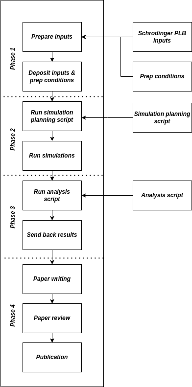

.. _public_overview:
*************************
Public Dataset Benchmarks
*************************

This page outlines the plans and the instructions for the public dataset portion of the 2024 OpenFE Industry Benchmark study.

Overview
********

The Public Benmarking Study concentrates on validating the use of the `OpenFE Toolkit <https://docs.openfree.energy/en/stable/>`_
on publicly available protein-ligand binding datasets. Specifically we concentrate
on re-calculating the `Schrodinger public binding free energy benchmark set <https://github.com/schrodinger/public_binding_free_energy_benchmark>`_
from the `2023 large scale study by Ross et al. <https://www.nature.com/articles/s42004-023-01019-9>`_.

*Figure 1: Overview of Public Dataset Benchmark process.*

As outlined in Figure 1, the public benchmark will be split into four phases:

1. Remediation and validation of input structures from the `Schrodinger public binding free energy benchmark set <https://github.com/schrodinger/public_binding_free_energy_benchmark>`_.
2. Simulating relevant free energy perturbations on each participating industry member’s own HPC resources.
3. Extracting and gathering results.
4. Processing results into a manuscript for submission to an appropriate journal.

At each stage of the process, the OpenFE team will provide necessary inputs and support to all participating members.

Before you start
****************

.. warning:: 

.. _public_phase1:

Phase 1: Preparing Inputs
*************************

In this phase, benchmark input structures will be prepared by industry partners for use with the OpenFE toolkit.

**Start date:** *Mid June 2024*

**End date:** *Mid July 2024*

Allocation Benchmark Systems
============================

Each participating industry partner will be expected to select one or more system for benchmarking.

Please see the :ref:`benchmark system overview <benchmark_systems>` for a list of all systems and which
of these have already been allocated.

At a very minimum, we aim to simulate these entirety of the following three datasets:

* JACS
* Fragments
* Merck

Please :ref:`get in touch <get_in_touch>` with the OpenFE team should you wish to select
any new systems or if you wish to be reminded of which systems you have been allocated.

Input Data Source
=================

Input structures, perturbation networks, and FEP+ results are taken from the `v2.0 release of the Schrodinger 2023 Public Benchmark set <https://github.com/schrodinger/public_binding_free_energy_benchmark/tree/v2.0>`_.

For convenience, a `snapshot of these inputs <https://github.com/OpenFreeEnergy/IndustryBenchmarks2024/tree/main/industry_benchmarks/input_structures/original_structures>`_ has been provided in the OpenFE 2024 benchmark repository.

Remediation of inputs
=====================

Input structures will need to be adapted in order to be used with the OpenFE toolkit.

Nominally input remediation will involve:

* Extracting any cofactors from input PDB files
* Fixing capping groups on terminal residues
* Mutating any non-canonical amino acids
* Addressing any issues with residue and atom names
* Removing alternate ligand conformational or protonation states

Depending on the software used to prepare the inputs, the resulting files may need to be stripped of extraneous or sensitive metadata.

A list of instructions and conditions for preparing inputs are provided :ref:`here <input_preparation>`.
Updates will be made to these instructions based on feedback by benchmark partners.

.. toctree::
   :maxdepth: 1
   :hidden:

   input_preparation

Depositing inputs
=================

All remediated inputs will be deposited in the `OpenFE 2024 benchmark repository <https://github.com/OpenFreeEnergy/IndustryBenchmarks2024>`_.
This will allow the OpenFE team to:

1. Gather preparation conditions to be included in relevant publications
2. Check-in with industry partners and gather feedback on the the input preparation experience
3. Allow for the OpenFE team to help with any unanticipated issues

Please see the :ref:`contributing inputs instructions <contributing-inputs>` for more details on this process.

.. toctree::
   :maxdepth: 1
   :hidden:

   contributing_inputs

Phase 2: Running Simulations
****************************

In this phase, industry partners will run alchemical transformations for their allocated systems on their HPC resources.

**Start date:** *Early July 2024*

**End date:** *End of August 2024*

Please note that we expect the private dataset industry benchmark to start alongside this phase.

Simulation Planning: LOMAP networks
===================================

The setup of the relative binding free energy network is carried out using the planning script provided under 
`utils/plan_rbfe_network.py <https://github.com/OpenFreeEnergy/IndustryBenchmarks2024/tree/main/industry_benchmarks/utils/plan_rbfe_network.py>`_.

This script will carry out the following steps:

* Loading the ligands, protein, and (if provided) cofactors
* Computing partial charges for ligands and cofactors using antechamber AM1BCC
* Creating a network of ligand transformations using the Kartograf atom mapper, LOMAP scorer, and LOMAP network generator
* Assigning settings to the transformations. Settings differ depending on whether the ligand transformation involves a change in net charge
   * non charge changing transformations: 11 lambda windows, 5 ns production run per lambda window
   * charge changing transformations: 22 lambda windows, 20 ns production run per lambda window
* Creating the ``AlchemicalTransformation``\ s for solvent and complex legs and saving them to disc as json files

In an environment with OpenFE 1.0 installed, please run this script by calling:

.. code-block:: bash

   # If you don’t have cofactors
   python plan_rbfe_network.py --pdb protein.pdb --ligands ligands.sdf --output network_setup

   # If you have cofactors
   python plan_rbfe_network.py --pdb protein.pdb --ligands ligands.sdf --cofactors cofactors.sdf --output network_setup

This command will create a folder (named ``network_setup`` as specified using the ``--output`` flag) that contains a separate ``.json`` file for the solvent and complex legs 
for every edge in the network. The folder also contains a ``ligand_network.graphml`` file that is a serialized version of the ``LigandNetwork``.

.. warning::
   Since the partial charge assignment can be slow, we recommend putting the planning command in a bash script and executing it on a high performance workstation or HPC resource. 

Simulation execution
====================

All planned simulations will be run by industry partners on their own clusters using OpenFE execution tooling,
i.e. through the `quickrun method <https://docs.openfree.energy/en/latest/guide/execution/quickrun_execution.html>`_.
You can find additional information and examples on how to run simulations of the entire network in the "Running the simulations" section of our `CLI tutorial <https://docs.openfree.energy/en/latest/tutorials/rbfe_cli_tutorial.html>`_.
In this study, we will use a slightly modified approach to our CLI Tutorial, allowing for execution of a single task per HPC job.

Here is an example of a very simple script that will create and submit a separate job script (`*.job` named file) for every alchemical transformation (for the simplest SLURM use case):

.. code-block:: bash

   for file in network_setup/*.json; do
     relpath=${file:14}  # strip off "network_setup/"
     dirpath=${relpath%.*}  # strip off final ".json"
     jobpath="network_setup/${dirpath}.job"
     for repeat in {0..2}; do
       cmd="openfe quickrun $file -o results_{repeat}/$relpath -d results_{repeat}/$dirpath"
       echo -e "#!/usr/bin/env bash\n${cmd}" > $jobpath
       sbatch $jobpath
     done 
   done

Please reach out to the openfe team if you have any questions on how to adapt this script to your internal needs, we would be happy to assist with this.

Simulation Cleanup
==================

.. _post-simulation cleanup:

.. warning::
   The simulation cleanup script is not yet available. Please retain all generated data for now. See the `data storage requirements`_ for more information.

A post-simulation cleanup script will be made available by the OpenFE team to reduce the amount of data you need to store after your simulations.

Compute Requirements
====================

To run the benchmark simulations following **GPU hardware** will be required:

* An NVIDIA GPU (CUDA 10.2 or above compatible)
  * In non-exclusive compute mode
* A single GPU ID assigned per `openfe quickrun` execution
  * e.g. by setting `CUDA_VISIBLE_DEVICE` if necessary
* Estimated **standard** transformation compute time:
  * Approximately 8-12 GPU hours per complex transformation repeat
  * Approximately 1-2 GPU hours per solvent transformation repeat
* Estimated **net charge** transformation compute time:
  * Approximately 4-7 GPU days per complex transformation repeat
  * Approximately 8-12 GPU hours per solvent transformation repeat

Data Storage Requirements
=========================

.. _data storage requirements:

.. warning::
   You will need to keep any temporary data until the `post-simulation cleanup`_ script is made available.

**Temporary data:**

*Retention time:* until the `post-simulation cleanup`_ script is applied to your data.
*Estimated storage costs:*
  * Standard simulations: **5-10 GB** per triplicate repeat cycle
  * Net charge transformation: **40-80 GB** per triplicate repeat cycle

This data contains the full simulation outputs, including large netcdf trajectories with 1 ps snapshots of the coordinates and energies. A cleanup script will be provided to extract relevant long-term data from these outputs.

**Long term data:**

*Retention time:* until the benchmark manuscript is accepted for publication.
*Estimated storage costs:* **sub 500 mb** per triplicate repeat cycle.

This long term data will be extracted from above-mentioned temporary data using the `post-simulation cleanup`_ script.

It will include:
  * Reduced potential arrays for free energy analysis
  * OpenFE output JSON files
  * PNGs from structural analysis
  * XTC coordinate trajectories for each lambda window containing 21 evenly spaced frames

The data will be kept around by each partner for further processing should it be necessary as part of the manuscript writing process.

Phase 3: Data Analysis
**********************

.. note::
   Details for phase 3 of the public dataset benchmarks are still being finalised. These will be updated as soon as possible!

In this phase, relevant simulation results will be gathered from industry partners.

**Start date:** *Early September 2024*

**End date:** *End of October 2024*

Gathering of results
====================

Industry partners will be expected to post-process simulation outputs using a specialized script provided by the OpenFE team.

This script will:

* Extract relevant free energy estimates, including time series of free energies
* Gather simulation health metrics
   * Overlap matrix and replica exchange probability plots
   * Relevant structural analysis plots
* Gather additional simulation information (optional)
   * Additional simulation metrics, relevant for the OpenFE 2024 scoring data project, may be gathered.

Industry partners will be expected to submit this information back to OpenFE for
analysis. Please note that all data will be collected in a human readable format
in order to allow industry partners the ability to review the data ahead of submission
back to the OpenFE team.

Analysis of results
===================

**Analysis of individual systems**

Initial analysis of results for each system will be carried out by each industry benchmark partner
with the help of the OpenFE development team.

**Analysis of all results**

A final analysis of all simulation results will be conducted by the OpenFE development team with
help from volunteering industry board and technical advisory committee members.

Phase 4: Paper writing
**********************

.. note::
   Details for phase 3 of the public dataset benchmarks are still being finalised. These will be updated as soon as possible!

**Start date:** *Early November 2024*

**End date:** *December 2024*

Drafting the manuscript
=======================

Once all results have been gathered, the OpenFE team alongside volunteer members of
the OpenFE board and technical advisory committee will draft a manuscript for open access
publication at a relevant journal.

Review of manuscript and authorship
===================================

All authors will be expected to review and approve the manuscript prior to journal submission.
We anticipate doing this in a two round process, the first round where authors are invited
to comment on the manuscript, followed by a second one for legal review by each partner organization.

Authorship will be offered to all those involved in the benchmarking process and inclusion will be
left to the discretion of each organization.

